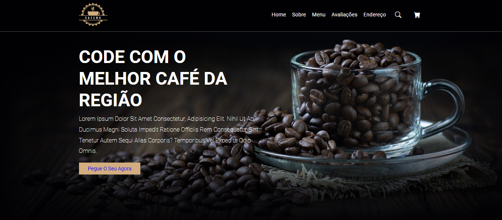
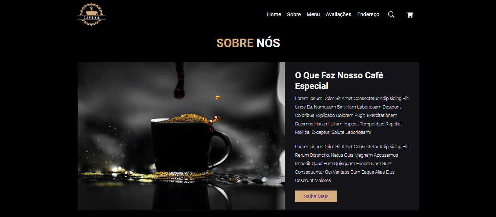
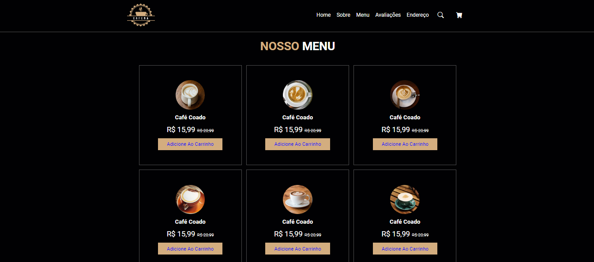
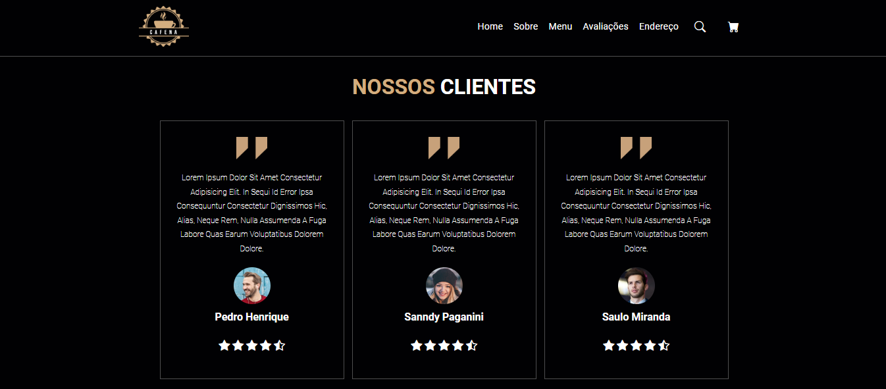

# Projeto Cafeteria

## Sobre

* Neste projeto, criei uma experiência virtual acolhedora e convidativa para os apreciadores de café com o projeto "Café DevClub". Utilizando HTML, CSS e JavaScript, desenvolvi um site com design responsivo, garantindo uma experiência de usuário perfeita em dispositivos móveis e desktops. 

## Recursos Principais:
  
* Destacamos uma variedade de menus de café, cada um apresentando uma seleção única de bebidas cuidadosamente elaboradas, desde expressos intensos até lattes cremosos. As imagens vibrantes e as descrições detalhadas despertam o paladar e a curiosidade dos visitantes, incentivando-os a explorar e experimentar novos sabores.

* Além disso, incluímos o endereço da loja para que os clientes possam facilmente encontrar o Café DevClub e desfrutar de uma experiência gastronômica única. Com uma interface intuitiva e atraente, nosso projeto convida os amantes do café a se reunirem e compartilharem momentos deliciosos em um ambiente virtualmente acolhedor. 

## Tecnologias Utilizadas 
    
*  
* 
* 

